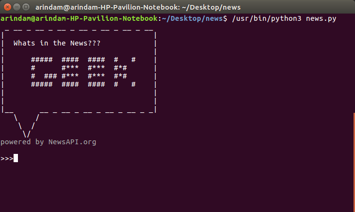

# Whats-in-the-news-GEEK

### powered by NewsAPI.org
Whats in the news?GEEK!!! is a program that is especially made for the geeks out there who could not leave their computer terminals so we bring all the news to them. The CLI is good enough so that the GEEKS feel at home. People could get a lot of news from all genre, thanks to newsapi.org

## Instal Dependencies

```sh
pip install -r requirements.txt
```

## Usage 
* Install all dependencies
* Clone this repository `git clone https://github.com/aribis369/Whats-in-the-news-GEEK`
* In the terminal, in the project directory, run ```python3 news.py```
* Use the program by giving suitable commands
* To see valid commands type ```help```

## Give it a look. Try it and give suggestions. PRs always open.


